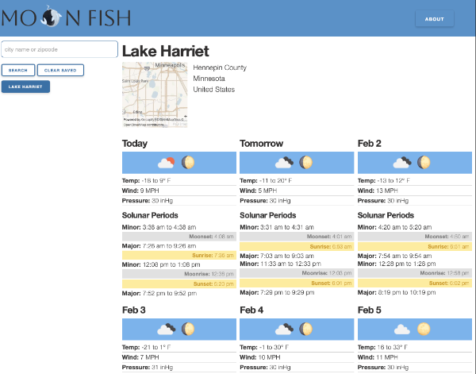
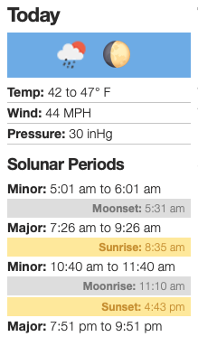

# Moon Fish

## Description
 Moon Fish was created using the solunar theory in combination with weather forecasts. Solunar theory hypothesizes that fish move according to the location of the moon in comparison to their bodies. Knowing the times of the tides, sunrise, sunset and more helps fishermen predict when fish are going to bite. For example, during a full moon or new moon fish are more active. This is because the tides intervene. The theory is the larger the tide the more active the fish are.

 Moon Fish not only looks to combine these pieces of information, but also the weather forecast. Not only do things like wind speed and barometric pressure affect fishing conditions as well, you might prefer not to go out on a fishing trip in the rain!

 You can access the application at [this location](https://lkalliance.github.io/Moon-Fish/).

 

## Usage

On the page's initial load, the user is offered a "Search" box. The user may enter any combination of things to search on: cities, states, counties, points of interest, countries, even zip codes. Upon submitting the search, the application presents a "confirmation modal", which displays a map tile and text information about the search result. If this is the correct location, the user can enter a label to use instead of the default city name, and the search will be saved with that label. Alternately, the user can indicate if this is not the correct search result, and search again.

Whether the user has done a new search or clicked on one of the saved locations in the search history, the main area of the screen displays the appropriate information: the same map tile and text information as on the confirmation screen, plus a seven-day forecast. Each forecas "card" has a lot of solunar and weather information:

* The prevailing weather conditions
* The phase of the moon
* The temperature range, high wind speed and barometric pressure
* The two major and two minor "Solunar Periods": times of the day where the position of the moon has the most positive effect on fishing
* The sunrise, sunset, moonrise and moonset for the day

At any time the user can start a new search, click on a saved search, or clear all the saved searches.

## Installation

There are no installations necessary for this page to operate. It currently uses HTML, CSS and Javascript, technologies that are built into any web browser. The browser DOES need to have Javascript enabled.

## Notes on Design

The design is responsive. By default the search area is to the left of the main display, while on small screens it moves to the top of the page. The forecast cards are also responsive, aligning in a 4-3 configuration to start, but chaging to 3-3-1, then 2-2-2-1, then simply one column as the window shrinks.

## Future additions

Features to add in later versions include more granular control for the user over the search-saving (and search-deleting) process, hourly data shown on the forecast cards for the next 48 hours, an interface to see a day on a timeline rather than on a list, and the ability to save entire datasets to local storage for either offline viewing or for copy-and-pasting into another application.

## Credits

All the code in this site was authored by Safia Ali, Lee Klusky, Michael Potter and Gabriella Swenson; with huge assists from the course teaching staff and the outstanding authors and commenters on code from around the web, most specifically at [W3Schools](https://w3schools.com/), [MDN](https://developer.mozilla.org/en-US/) and [Stack Overflow](https://stackoverflow.com).

This site was built using the [jQuery Javascript library](https://jquery.com), the [Day.js javascript library](https://day.js.org), the [Milligram+](https://evodim.github.io/mgplus/) and [Spectre](https://picturepan2.github.io/spectre/getting-started/installation.html) CSS libraries, and [Google Fonts](https://fonts.google.com).

Data comes from public APIs at [Geoapify.com](https://www.geoapify.com), [OpenWeatherMaps.org](https://openweathermap.org) and [Solunar.org](https://solunar.org).

Logo design by Rachel Klusky.

## License

This web application is covered by the MIT license.
